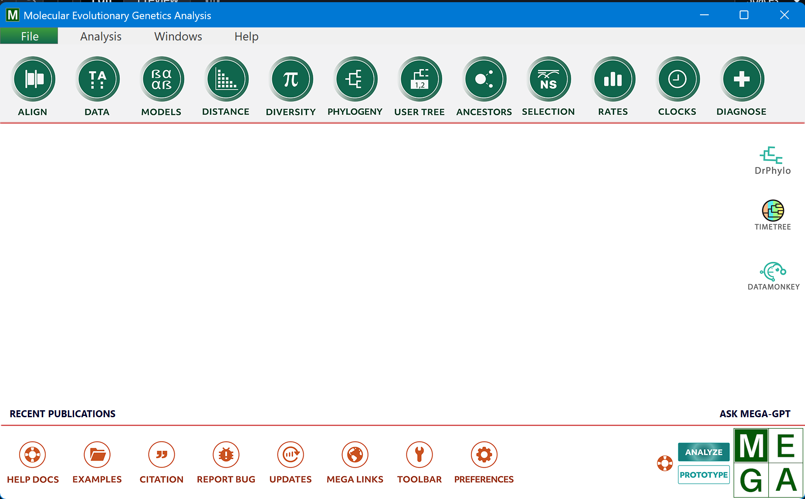
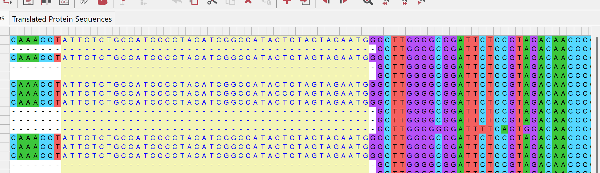

# MEGA (Molecular Evolutionary Genetics Analysis)

MEGA (Molecular Evolutionary Genetics Analysis) es un software integral y gratuito utilizado para el análisis de secuencias de ADN y proteínas.
Es una herramienta con una interfaz gráfica amigable para estudiantes e investigadores.

## Paso 1: ENLACE PARA DESCARGAR MEGA
https://www.megasoftware.net/

Seleccionas la versión y sistema operativo indicado.

## PASO 2. ABRIR ARCHIVO 

En la barra superior, se da clic en `File` > `Open a File/Session...`

Se selecciona el archivo `alineamiento_muscle_militaris.fasta` > `Abrir` > `Align`

## PASO 3. BORRAR COLUMNAS CON GAPS

La que aparece en la ventana es similar a la siguiente imagen. 

Para borrar las zonas con gaps, colocamos el cursor en la parte superior de las secuencias, damos clic y seleccionamos las zonas a borrar, estas columnas se tornarán de color amarillo, posteriormente se da `Supr`, hasta quedarnos con 300 pb.

