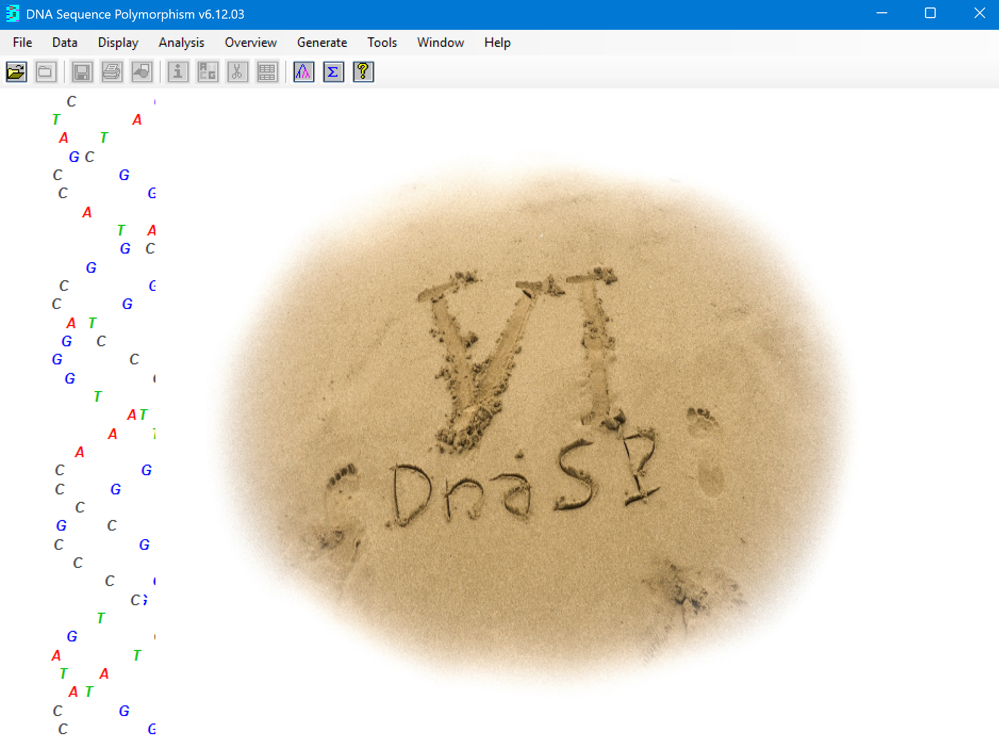
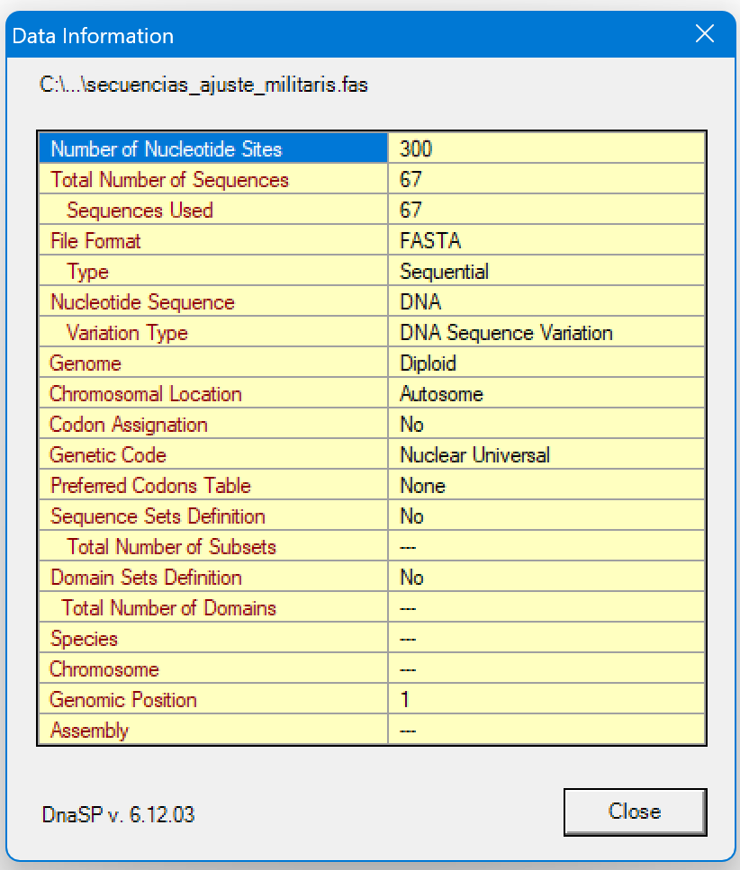

# DESCARGA DEL PROGRAMA

https://www.ub.edu/dnasp/index_v5.html

# PASO 1. ABRIR DOCUMENTO
 En la barra superior, damos clic en `File` > `Open Data File…` > seleccionamos el archivo creado en el MEGA,  en este caso es `secuencias_ajuste_militaris.Fas`

 Después, aparecera una tabla con las caracteristicas de nuestro documento. Como la siguiente:

 

# PASO 2. ANALISIS 
Se da clic en `Analysis` >`Gene Flow and Genetic Differentiation…`.
En la Ventana que se abre, se agrupan por poblaciones, esto por el orden de los códigos.
 

 
 
 
