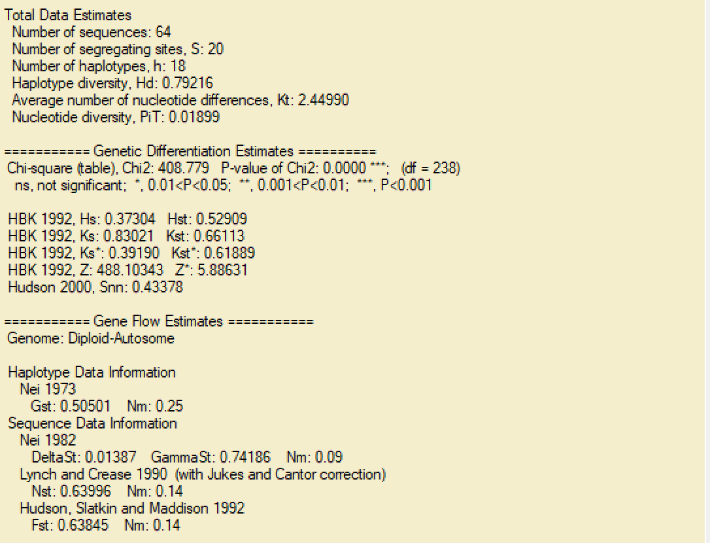

# DnaSP (DNA Sequence Polymorphism)

DnaSP (DNA Sequence Polymorphism) es un programa informático especializado para analizar polimorfismo de secuencias de ADN y realizar inferencias estadísticas sobre evolución molecular. Es ampliamente utilizado para calcular medidas de diversidad nucleotídica, tests de neutralidad y detectar recombinación. Es una herramienta clave en estudios de genética de poblaciones.

## DESCARGA DEL PROGRAMA

https://www.ub.edu/dnasp/index_v5.html

## PASO 1. ABRIR DOCUMENTO
 En la barra superior, damos clic en `File` > `Open Data File…` > seleccionamos el archivo creado en el MEGA,  en este caso es `secuencias_ajuste_militaris.Fas`

 Después, aparecera una tabla con las caracteristicas de nuestro documento. Como la siguiente:

 

## PASO 2. ANALISIS 
Se da clic en `Analysis` >`Gene Flow and Genetic Differentiation…`.
En la Ventana que se abre, se agrupan por poblaciones, esto por el orden de los códigos.

 

 Para ver los codigos de las poblaciones, consultar :

 [Ver metadata](https://github.com/J00719/filogeografia_ara_militaris/blob/main/1%20Data/Metadada/metadata_militaris.csv)

 

 
 
 
