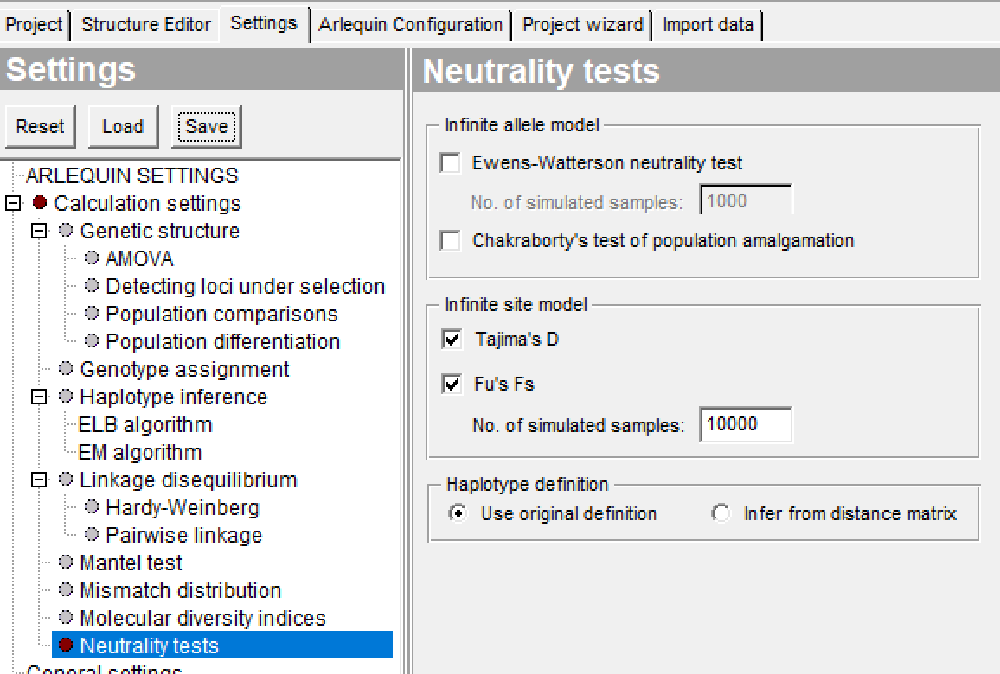
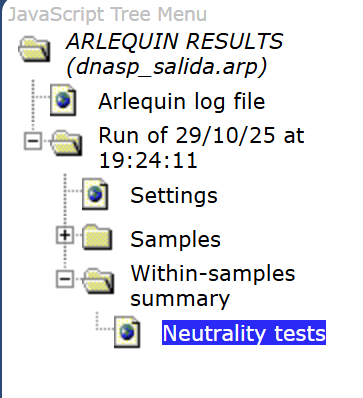

# ARLEQUIN 3.5.2.2

ARLEQUIN 3.5.2.2 es un software de análisis estadístico especializado en estudios de genética de poblaciones. Permite calcular estadísticos de diversidad genética, realizar pruebas de diferenciación poblacional (como AMOVA) e inferir estructura poblacional.

# DESCARGAR DE ARLEQUIN 3.5.2.2

Enlace de descarga

https://cmpg.unibe.ch/software/arlequin35/

## Abrir archivo
En la barra superior, damos clic en `Open Project` > seleccionamos nuestro archivo de salida de DnaSP en formato `.arp` > `Settings` > `Neutrality test` > marcamos el cuadro de `Tajima´s D` y el de` Fu´s Fs`  > en `No. Of simulated simples` cambiamos a `10000`.

## Ver resultados
En la barra superior se da clic en `View results`, en la ventana que se abre se selecciona el directorio de `Neutrality tests`

